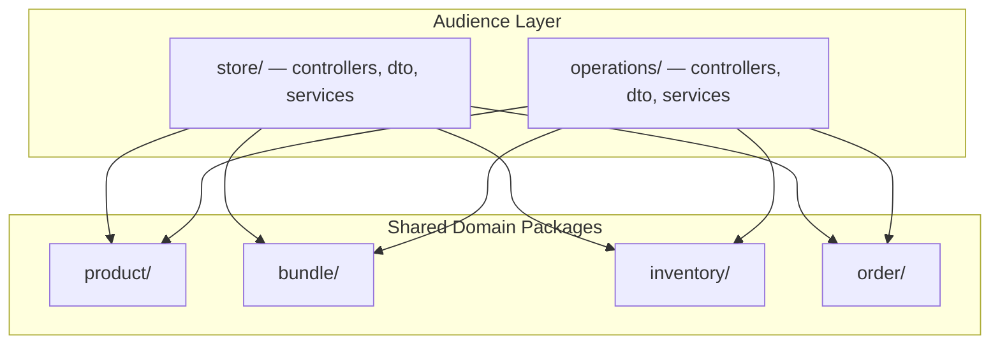

# API Design & Package Structure

## Store API (`/api/v1/store`)

Customer-facing. Mostly read-only, no auth required for browsing.

| Method | Endpoint | Purpose |
|---|---|---|
| GET | `/products` | List active products (filterable by `?category=`) |
| GET | `/products/{slug}` | Product detail (includes FoodInfo, images) |
| GET | `/bundles` | List active bundles |
| GET | `/bundles/{slug}` | Bundle detail (includes constituent products) |
| POST | `/orders` | Place an order (guest checkout) |
| GET | `/orders/{token}` | View order status (token from confirmation email) |
| PATCH | `/orders/{token}/cancel` | Customer self-cancellation (PENDING or CONFIRMED only) |

**Notes:**
- No JWT required for customers
- Order access via unguessable token (UUID sent in confirmation email)
- Storefront filter toggle: `Pojedinačno` → `/products`, `Setovi` → `/bundles`

## Operations API (`/api/v1/operations`)

Business operators. All endpoints require `HONEY_OPERATOR` role in JWT.

### Products & Bundles

| Method | Endpoint | Purpose |
|---|---|---|
| GET | `/products` | List all products (including inactive) |
| GET | `/products/{id}` | Product detail |
| POST | `/products` | Create product |
| PUT | `/products/{id}` | Update product |
| PATCH | `/products/{id}/status` | Activate/deactivate |
| POST | `/products/{id}/images` | Upload image (multipart → S3/MinIO) |
| DELETE | `/products/{id}/images/{imageId}` | Remove image |
| GET | `/bundles` | List all bundles |
| POST | `/bundles` | Create bundle |
| PUT | `/bundles/{id}` | Update bundle |
| PATCH | `/bundles/{id}/status` | Activate/deactivate |

### Inventory

| Method | Endpoint | Purpose |
|---|---|---|
| GET | `/inventory` | List all stock levels (with low-stock flag) |
| PATCH | `/inventory/{productId}` | Update stock (restock or adjust) |

### Orders

| Method | Endpoint | Purpose |
|---|---|---|
| GET | `/orders` | List orders (filterable by status, date range) |
| GET | `/orders/{id}` | Order detail |
| PATCH | `/orders/{id}/status` | Transition order status (enforced state machine) |

### Reports

| Method | Endpoint | Purpose |
|---|---|---|
| GET | `/reports/sales-summary` | Revenue, order count by period |
| GET | `/reports/top-products` | Best sellers by quantity/revenue |

## Cross-Cutting Decisions

- **Order state machine:** valid transitions enforced server-side (see [Order State Machine](order-state-machine.md))
- **Image storage:** S3/MinIO — images uploaded via operations API, served via public bucket URL
- **Notifications:** order placement publishes event to RabbitMQ → `notification-manager` sends confirmation email to customer and alert to operator
- **Customer order access:** token-based (unguessable UUID in confirmation email link), no account needed

---

## Package Structure

```
com.playground.honey_manager/
├── config/                          # Security, S3, RabbitMQ, web config
├── store/                           # Customer-facing API
│   ├── api/
│   │   ├── controllers/            # StoreProductController, StoreBundleController, StoreOrderController
│   │   └── dto/                    # Slim responses
│   └── services/
│       ├── interfaces/
│       └── impl/                   # Store-specific orchestration (place order flow)
├── operations/                      # Business operator API
│   ├── api/
│   │   ├── controllers/            # OpsProductController, OpsOrderController, OpsInventoryController, OpsReportController
│   │   └── dto/                    # Rich requests/responses
│   └── services/
│       ├── interfaces/
│       └── impl/                   # Ops-specific orchestration (status transitions, reports)
├── product/                         # Shared product domain
│   ├── dataaccess/
│   │   ├── entities/               # Product, FoodInfo, ProductImage
│   │   └── repositories/
│   ├── services/
│   │   ├── interfaces/
│   │   ├── impl/
│   │   └── model/                  # ProductCategory enum, domain models
│   └── mappers/
├── bundle/                          # Shared bundle domain
│   ├── dataaccess/
│   │   ├── entities/               # Bundle, BundleItem
│   │   └── repositories/
│   ├── services/
│   │   ├── interfaces/
│   │   └── impl/
│   └── mappers/
├── inventory/                       # Shared inventory domain
│   ├── dataaccess/
│   │   ├── entities/
│   │   └── repositories/
│   ├── services/
│   │   ├── interfaces/
│   │   └── impl/
│   └── mappers/
├── order/                           # Shared order domain
│   ├── dataaccess/
│   │   ├── entities/               # Order, OrderItem, Address (embeddable)
│   │   └── repositories/
│   ├── services/
│   │   ├── interfaces/
│   │   ├── impl/
│   │   └── model/                  # OrderStatus, PaymentMethod, state machine
│   └── mappers/
├── messaging/
│   ├── producers/                   # OrderPlacedEvent publisher
│   └── events/                      # Event payload classes
├── errors/
│   ├── advice/
│   ├── custom/
│   └── exceptions/
└── log/                             # MdcLoggingFilter
```

## Sharing Boundary



- **Shared domain packages** contain reusable single-responsibility logic: `ProductService.findActiveBySlug()`, `OrderService.create()`, `InventoryService.reserve()`
- **Audience-specific services** are orchestrators that compose shared services into workflows:
  - `StoreOrderService.placeOrder()` → validate stock → reserve inventory → create order → publish event
  - `OpsOrderService.transitionStatus()` → enforce state machine → update status → commit reserved inventory if shipped
- No cross-dependency between `store/` and `operations/`
