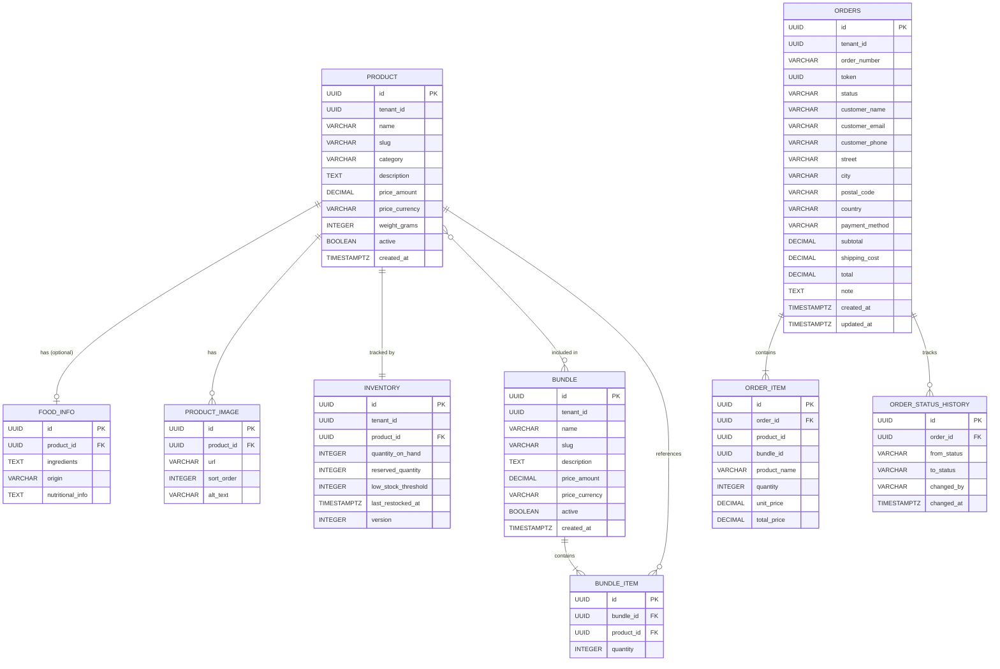

# Domain Model & Database Schema

## Entities

```
Product          (tenantId, name, slug, category, price, weight, description, active)
FoodInfo         (productId, ingredients, origin, nutritionalInfo)  ← optional 1:1
ProductImage     (productId, url, sortOrder, altText)
Bundle           (tenantId, name, slug, description, price, active)
BundleItem       (bundleId, productId, quantity)
Inventory        (tenantId, productId, quantityOnHand, reservedQuantity, lowStockThreshold)
Order            (tenantId, orderNumber, status, customerName, customerEmail, customerPhone, shippingAddress, paymentMethod, subtotal, shippingCost, total, note)
OrderItem        (orderId, productId, bundleId, productName, quantity, unitPrice, totalPrice)
Address          (street, city, postalCode, country)  ← embedded in Order
```

## Enums

```
ProductCategory : HONEY, TEA, GINGERBREAD, MERCHANDISE
OrderStatus     : PENDING, CONFIRMED, SHIPPED, DELIVERED, CANCELLED
PaymentMethod   : CASH_ON_DELIVERY, BANK_TRANSFER
```

## Relationships

```
Product  1──1  FoodInfo        (optional — only for food products)
Product  1──*  ProductImage
Product  1──1  Inventory
Product  *──*  Bundle          (through BundleItem)
Order    1──*  OrderItem
OrderItem *──1 Product         (nullable, snapshot)
OrderItem *──1 Bundle          (nullable, snapshot)
```

## Key Design Decisions

1. **Product vs FoodInfo separation** — `Product` holds universal fields (name, price, weight). `FoodInfo` is an optional 1:1 for food-specific data (ingredients, nutritional info, origin). Non-food items (mugs, merchandise) simply have no `FoodInfo` row. Storefront conditionally renders PDP tabs based on presence.

2. **No Customer entity** — Guest checkout per spec. Customer info captured as snapshot on Order. Repeat-customer tracking deferred.

3. **Order snapshots product data** — `OrderItem` stores `productName` and `unitPrice` at time of purchase. Price changes don't affect historical orders.

4. **Inventory as separate entity** — Different update cadence than Product. Tracks `reservedQuantity` for pending orders. Enables low-stock alerts.

5. **Bundle as separate entity** — Distinct pricing logic (discount vs sum of parts). Inventory tracked at product level, not bundle level. Storefront displays both in same grid with filter toggle.

6. **Each product size is a separate Product** — No variant system for MVP. "Samo Med 250g" and "Samo Med 500g" are two products. Variants can be introduced later.

## Multi-Tenancy Strategy

**MVP:** Single tenant ("samo."). All data belongs to one business.

**Future-proofing (implemented now):**
- `tenantId: UUID` column on core entities (Product, Bundle, Inventory, Order)
- Service layer methods accept `tenantId` as parameter
- Composite indexes include `tenantId`

**Not implemented for MVP:**
- Tenant management UI
- Tenant onboarding
- Row-level security / schema-per-tenant
- Tenant-specific branding or domains

---

## Entity Relationship Diagram



---

## Migration Tool: Flyway

This service uses Flyway instead of Liquibase. Migrations live in:

```
src/main/resources/db/migration/
├── V1__create_product_tables.sql
├── V2__create_bundle_tables.sql
├── V3__create_inventory_table.sql
├── V4__create_order_tables.sql
└── ...
```

## Tables

```sql
-- =============================================
-- PRODUCT
-- =============================================
CREATE TABLE product (
    id              UUID PRIMARY KEY,
    tenant_id       UUID NOT NULL,
    name            VARCHAR(255) NOT NULL,
    slug            VARCHAR(255) NOT NULL,
    category        VARCHAR(50) NOT NULL,
    description     TEXT,
    price_amount    DECIMAL(10,2) NOT NULL,
    price_currency  VARCHAR(3) NOT NULL DEFAULT 'EUR',
    weight_grams    INTEGER,
    active          BOOLEAN NOT NULL DEFAULT TRUE,
    created_at      TIMESTAMPTZ NOT NULL,

    CONSTRAINT uq_product_slug UNIQUE (tenant_id, slug)
);

CREATE INDEX idx_product_tenant_active ON product (tenant_id, active);
CREATE INDEX idx_product_tenant_category ON product (tenant_id, category);

-- =============================================
-- FOOD INFO (optional 1:1 with product)
-- =============================================
CREATE TABLE food_info (
    id                UUID PRIMARY KEY,
    product_id        UUID NOT NULL UNIQUE,
    ingredients       TEXT,
    origin            VARCHAR(255),
    nutritional_info  TEXT,

    CONSTRAINT fk_food_info_product FOREIGN KEY (product_id) REFERENCES product(id)
);

-- =============================================
-- PRODUCT IMAGE
-- =============================================
CREATE TABLE product_image (
    id          UUID PRIMARY KEY,
    product_id  UUID NOT NULL,
    url         VARCHAR(1024) NOT NULL,
    sort_order  INTEGER NOT NULL DEFAULT 0,
    alt_text    VARCHAR(255),

    CONSTRAINT fk_product_image_product FOREIGN KEY (product_id) REFERENCES product(id)
);

CREATE INDEX idx_product_image_product ON product_image (product_id);

-- =============================================
-- BUNDLE
-- =============================================
CREATE TABLE bundle (
    id              UUID PRIMARY KEY,
    tenant_id       UUID NOT NULL,
    name            VARCHAR(255) NOT NULL,
    slug            VARCHAR(255) NOT NULL,
    description     TEXT,
    price_amount    DECIMAL(10,2) NOT NULL,
    price_currency  VARCHAR(3) NOT NULL DEFAULT 'EUR',
    active          BOOLEAN NOT NULL DEFAULT TRUE,
    created_at      TIMESTAMPTZ NOT NULL,

    CONSTRAINT uq_bundle_slug UNIQUE (tenant_id, slug)
);

-- =============================================
-- BUNDLE ITEM
-- =============================================
CREATE TABLE bundle_item (
    id          UUID PRIMARY KEY,
    bundle_id   UUID NOT NULL,
    product_id  UUID NOT NULL,
    quantity    INTEGER NOT NULL DEFAULT 1,

    CONSTRAINT fk_bundle_item_bundle FOREIGN KEY (bundle_id) REFERENCES bundle(id),
    CONSTRAINT fk_bundle_item_product FOREIGN KEY (product_id) REFERENCES product(id)
);

CREATE INDEX idx_bundle_item_bundle ON bundle_item (bundle_id);

-- =============================================
-- INVENTORY
-- =============================================
CREATE TABLE inventory (
    id                  UUID PRIMARY KEY,
    tenant_id           UUID NOT NULL,
    product_id          UUID NOT NULL UNIQUE,
    quantity_on_hand    INTEGER NOT NULL DEFAULT 0,
    reserved_quantity   INTEGER NOT NULL DEFAULT 0,
    low_stock_threshold INTEGER NOT NULL DEFAULT 5,
    last_restocked_at   TIMESTAMPTZ,
    version             INTEGER NOT NULL DEFAULT 0,

    CONSTRAINT fk_inventory_product FOREIGN KEY (product_id) REFERENCES product(id)
);

-- =============================================
-- ORDERS
-- =============================================
CREATE TABLE orders (
    id              UUID PRIMARY KEY,
    tenant_id       UUID NOT NULL,
    order_number    VARCHAR(20) NOT NULL,
    token           UUID NOT NULL,
    status          VARCHAR(20) NOT NULL,
    customer_name   VARCHAR(255) NOT NULL,
    customer_email  VARCHAR(255) NOT NULL,
    customer_phone  VARCHAR(50),
    street          VARCHAR(255) NOT NULL,
    city            VARCHAR(100) NOT NULL,
    postal_code     VARCHAR(20) NOT NULL,
    country         VARCHAR(5) NOT NULL DEFAULT 'HR',
    payment_method  VARCHAR(30) NOT NULL,
    subtotal        DECIMAL(10,2) NOT NULL,
    shipping_cost   DECIMAL(10,2) NOT NULL DEFAULT 0,
    total           DECIMAL(10,2) NOT NULL,
    note            TEXT,
    created_at      TIMESTAMPTZ NOT NULL,
    updated_at      TIMESTAMPTZ NOT NULL,

    CONSTRAINT uq_order_number UNIQUE (tenant_id, order_number),
    CONSTRAINT uq_order_token UNIQUE (token)
);

CREATE INDEX idx_orders_tenant_status ON orders (tenant_id, status);
CREATE INDEX idx_orders_tenant_created ON orders (tenant_id, created_at DESC);
CREATE INDEX idx_orders_token ON orders (token);

-- =============================================
-- ORDER ITEM
-- =============================================
CREATE TABLE order_item (
    id            UUID PRIMARY KEY,
    order_id      UUID NOT NULL,
    product_id    UUID,
    bundle_id     UUID,
    product_name  VARCHAR(255) NOT NULL,
    quantity      INTEGER NOT NULL,
    unit_price    DECIMAL(10,2) NOT NULL,
    total_price   DECIMAL(10,2) NOT NULL,

    CONSTRAINT fk_order_item_order FOREIGN KEY (order_id) REFERENCES orders(id)
);

CREATE INDEX idx_order_item_order ON order_item (order_id);

-- =============================================
-- ORDER STATUS HISTORY
-- =============================================
CREATE TABLE order_status_history (
    id          UUID PRIMARY KEY,
    order_id    UUID NOT NULL,
    from_status VARCHAR(20),
    to_status   VARCHAR(20) NOT NULL,
    changed_by  VARCHAR(255) NOT NULL,
    changed_at  TIMESTAMPTZ NOT NULL,

    CONSTRAINT fk_order_history_order FOREIGN KEY (order_id) REFERENCES orders(id)
);

CREATE INDEX idx_order_status_history_order ON order_status_history (order_id);
```

## Schema Design Notes

1. **Table named `orders`** — `order` is a reserved SQL keyword
2. **Address embedded in `orders`** — no separate table; guest checkout means no address reuse for MVP
3. **`token` on orders** — unguessable UUID for customer access via confirmation email link
4. **`order_number`** — human-readable sequential identifier (e.g. "SM-00042"), generated by application, unique per tenant
5. **No FK from `order_item` to `product`/`bundle`** — order items are snapshots; product deletion must not break order history
6. **Optimistic locking on `inventory`** — `version` column with JPA `@Version`; handles concurrent stock updates at low volume without pessimistic locks
