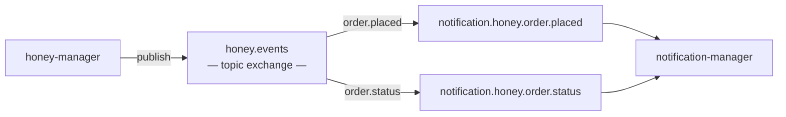

# Messaging (RabbitMQ)

## Events Published by honey-manager

| Event | When | Email to |
|---|---|---|
| `OrderPlacedEvent` | Customer places order | Customer (confirmation) + Operator (new order alert with link to order detail) |
| `OrderStatusChangedEvent` | Status transitions | Customer (status update) |

## Event Payloads

```
OrderPlacedEvent {
    orderId: UUID
    orderNumber: String
    token: UUID
    customerName: String
    customerEmail: String
    items: List<{productName, quantity, unitPrice}>
    total: BigDecimal
    paymentMethod: String
    shippingAddress: {street, city, postalCode, country}
    occurredAt: Instant
}

OrderStatusChangedEvent {
    orderId: UUID
    orderNumber: String
    token: UUID
    customerEmail: String
    fromStatus: String
    toStatus: String
    occurredAt: Instant
}
```

## Topology



Topic exchange allows future consumers (e.g., analytics) to bind to `order.*` without changing the producer.

## Consumer: notification-manager

The existing `notification-manager` gets new queue bindings and email templates for honey events. No separate service needed — payloads are self-contained (recipient, data for template rendering), no callbacks to honey-manager required.

Email templates built during notification integration phase.

## Publisher Confirms

Same pattern as existing services:
- `publisher-confirm-type: correlated`
- Correlation ID per message
- Pending message store (Redis-backed) for retry on NACK
- DLQ for exhausted retries
