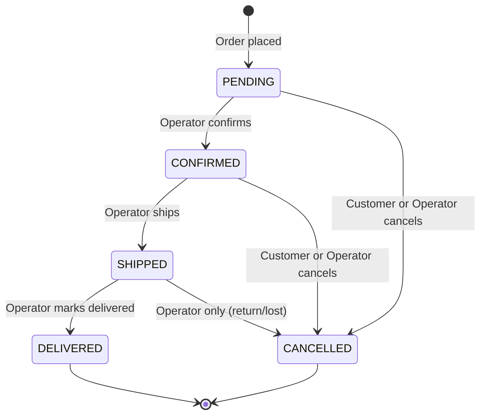

# Order State Machine

## State Diagram



## Valid Transitions

| From | To | Who | Side effects |
|---|---|---|---|
| PENDING | CONFIRMED | Operator | — |
| PENDING | CANCELLED | Customer or Operator | Release reserved inventory |
| CONFIRMED | SHIPPED | Operator | Commit reserved inventory (deduct from quantityOnHand) |
| CONFIRMED | CANCELLED | Customer or Operator | Release reserved inventory |
| SHIPPED | DELIVERED | Operator | — |
| SHIPPED | CANCELLED | Operator only | Restore stock to quantityOnHand |

## Rules

- **DELIVERED** and **CANCELLED** are terminal — no transitions out
- **Customer can cancel** while PENDING or CONFIRMED (via token link)
- **Customer cannot cancel** once SHIPPED — only operator can (returns/lost packages)
- Each transition appends to `OrderStatusHistory` and updates `Order.updatedAt`
- Status changes publish event → `notification-manager` emails customer

## Customer Order Flow

1. Customer places order → status = PENDING, inventory reserved
2. Confirmation email sent with unique unguessable token link: `/store/orders/{token}`
3. Customer views status and can cancel (if PENDING or CONFIRMED) via that link
4. Once SHIPPED → cancel option disappears, only tracking visible

## Order Status History

Every transition is recorded:

```
OrderStatusHistory (id, orderId, fromStatus, toStatus, changedBy, changedAt)
```

Used for operations app timeline view and customer-facing order tracking.

## Implementation

Enum-based state machine — no framework needed:

```java
public enum OrderStatus {
    PENDING, CONFIRMED, SHIPPED, DELIVERED, CANCELLED;

    private static final Map<OrderStatus, Set<OrderStatus>> VALID_TRANSITIONS = Map.of(
        PENDING, Set.of(CONFIRMED, CANCELLED),
        CONFIRMED, Set.of(SHIPPED, CANCELLED),
        SHIPPED, Set.of(DELIVERED, CANCELLED),
        DELIVERED, Set.of(),
        CANCELLED, Set.of()
    );

    public boolean canTransitionTo(OrderStatus target) {
        return VALID_TRANSITIONS.get(this).contains(target);
    }
}
```

Service layer calls `currentStatus.canTransitionTo(newStatus)` and throws domain exception if invalid. Customer-initiated cancellations additionally check that status is PENDING or CONFIRMED.
